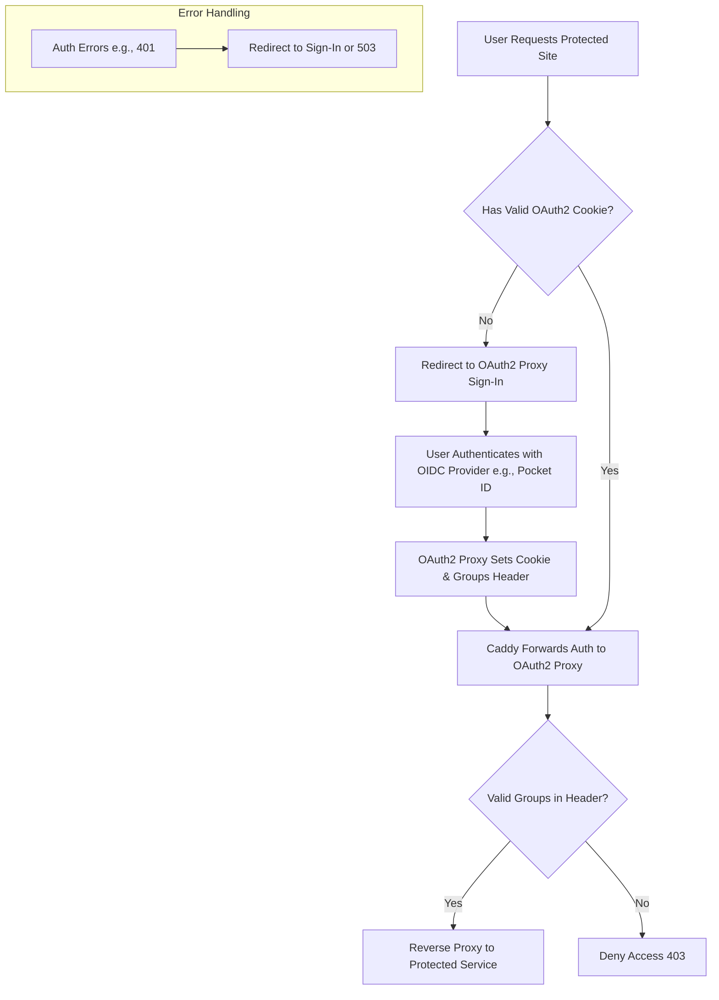
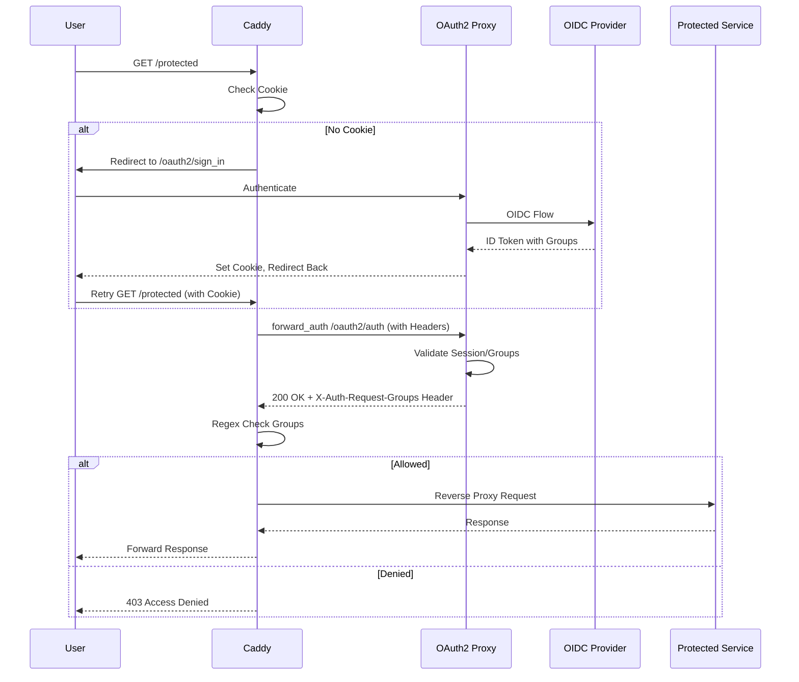
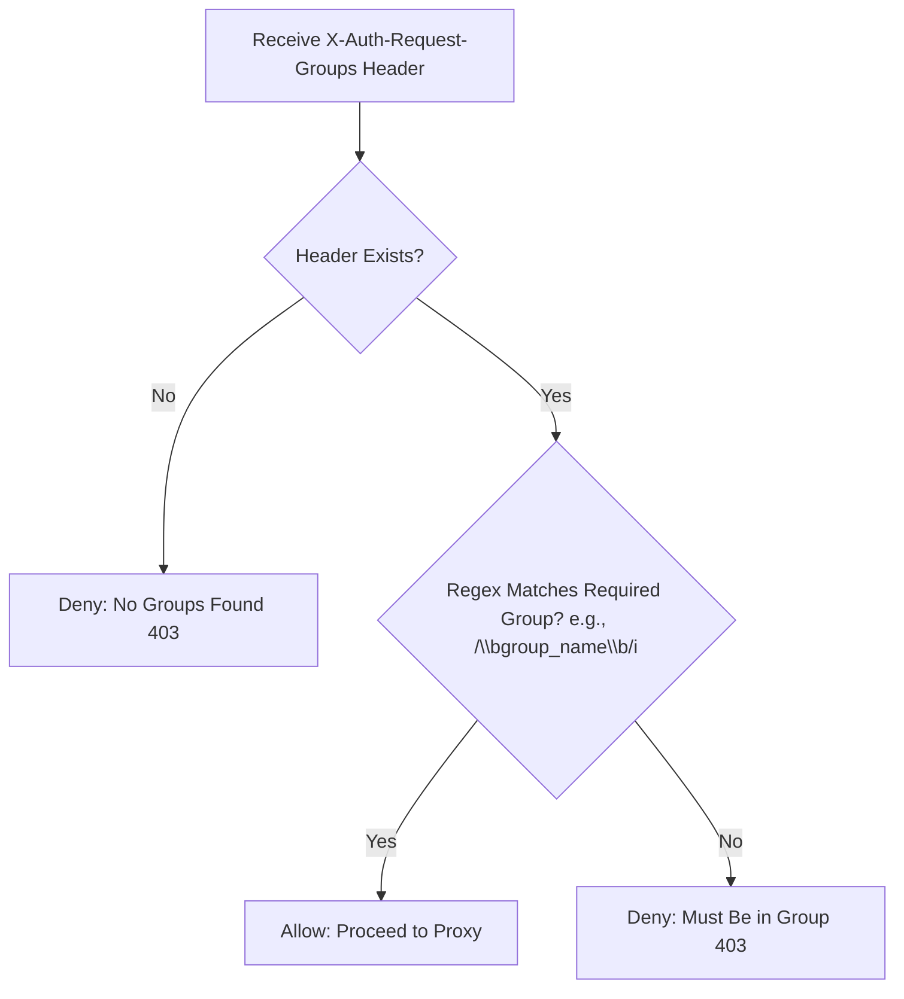

# Caddy OAuth2 Proxy Authentication Template with Group Checks

This repository provides a genericized Caddyfile template for implementing OAuth2 authentication using [OAuth2 Proxy](https://oauth2-proxy.github.io/oauth2-proxy/) as middleware and a self-hosted OIDC provider (e.g., [Pocket ID](https://pocket-id.org/) or similar for group claims). It's focused on the auth aspects, with reusable snippets for cookie checks, forward auth, group verification, and error handling.

I built this after trial-and-error because good examples were scarce. Feel free to fork, adapt, and contribute!

## Features
- Redirects unauthenticated users to OAuth2 Proxy sign-in.
- Forward auth to validate sessions and enrich with group headers.
- Case-insensitive regex group checks for role-based access control.
- Custom error handling and deny responses.
- Examples for protected sites, including one with public path exceptions.

## Prerequisites
- Caddy v2.10.0
- OAuth2 Proxy running and configured with your OIDC provider to pass groups via `X-Auth-Request-Groups` header.
- Self-hosted OIDC provider that includes group claims in ID tokens.

## Genericized Caddyfile
See the full [Caddyfile](./Caddyfile) in this repo. Here's a preview:

```caddy
# Core Auth Snippets

(auth_error_handler) {
	handle_errors {
		@unauthenticated expression `{http.error.status_code} == 401`
		redir @unauthenticated https://{oauth_proxy_host}/oauth2/sign_in?rd=https://{host}{uri} 302
		respond "Service is currently unavailable. Please try again later." 503
	}
}

(auth_cookie_check) {
	@noauth not header Cookie *_oauth2_proxy=*
	redir @noauth https://{oauth_proxy_host}/oauth2/sign_in?rd=https://{host}{uri} 302
}

(auth_forward) {
	forward_auth {oauth_proxy_host:port} {
		uri /oauth2/auth
		copy_headers X-Auth-Request-Groups
		header_up X-Auth-Request-Redirect https://{host}{uri}
	}
}

(auth_group_check) {
	@no_groups not header X-Auth-Request-Groups *
	respond @no_groups "Access denied: No group membership found." 403
	@allowed header_regexp X-Auth-Request-Groups (?i)\b{args[0]}\b
}

(auth_deny_response) {
	respond "Access denied: You must be in the '{args[0]}' group." 403
}

(simple_error_handler) {
	handle_errors {
		respond "Something went wrong." 500
	}
}

# OAuth2 Proxy Itself (Unauthenticated, as it's the auth entrypoint)
{oauth_proxy_domain} {
	reverse_proxy {oauth_proxy_internal_url}  # e.g., http://localhost:4180
	import simple_error_handler
}

# Example: Protected Site for "infra" Group
infra-example.{your_domain} {
	import auth_error_handler
	import auth_cookie_check
	import auth_forward
	import auth_group_check infra
	handle @allowed {
		reverse_proxy {protected_service_url}  # e.g., https://internal-service:8006
	}
	import auth_deny_response infra
	import simple_error_handler
}

# Example: Protected Site for "all_team" Group
team-example.{your_domain} {
	import auth_error_handler
	import auth_cookie_check
	import auth_forward
	import auth_group_check all_team
	handle @allowed {
		reverse_proxy {protected_service_url}  # e.g., http://internal-service:9182
	}
	import auth_deny_response all_team
	import simple_error_handler
}

# Example: Protected Site with Custom Path Handling (e.g., Public FAQ with Auth Fallback)
special-example.{your_domain} {
	import auth_error_handler
	route {
		@public_path path /public/api/path  # Adjust to your public paths
		handle @public_path {
			reverse_proxy {public_service_url}  # Allow unauth access to specific paths
		}
		import auth_cookie_check
		import auth_forward
		import auth_group_check restricted_group
		handle @allowed {
			reverse_proxy {protected_service_url}
		}
		import auth_deny_response restricted_group
	}
	import simple_error_handler
}
```

Replace placeholders like `{oauth_proxy_host:port}`, `{your_domain}`, and `{protected_service_url}` with your values.

## How It Works
### Auth Flow Overview
1. User requests a protected site.
2. Caddy checks for OAuth2 cookie—if missing, redirect to sign-in.
3. Forward auth subrequest to OAuth2 Proxy for validation and group headers.
4. Verify groups with regex—if matched, proxy to upstream; else, deny with 403.
5. Handle errors gracefully (e.g., 401 redirects back to sign-in).

### Applying the Snippets: Example Breakdown
For the `infra-example.{your_domain}` site:

1. **Error Handling (`import auth_error_handler`)**: Catches 401s and redirects or shows 503.
2. **Cookie Check (`import auth_cookie_check`)**: Redirects if no `*_oauth2_proxy=*` cookie.
3. **Forward Auth (`import auth_forward`)**: Subrequest to OAuth2 Proxy's `/oauth2/auth`, copies groups.
4. **Group Check (`import auth_group_check infra`)**: Defines `@allowed` if "infra" matches in headers.
5. **Allowed Handle (`handle @allowed { reverse_proxy ... }`)**: Proxies if allowed.
6. **Deny Response (`import auth_deny_response infra`)**: Custom 403 if denied.
7. **Fallback Errors (`import simple_error_handler`)**: Generic 500 for other issues.

Other sites follow similarly, with variations like custom routes in `special-example`.

## Customization Tips
- For self-signed upstream certs: Add `transport http { tls_insecure_skip_verify }` in reverse_proxy.
- OAuth2 Proxy Config: Ensure `--pass-user-headers=true` and group claims mapping.
- Testing: Use `caddy validate` and start small—test OAuth2 Proxy site first.

## Common Pitfalls
- Redirect loops: Match cookie domains (e.g., `.your_domain`).
- Group headers missing: Verify OIDC claims and OAuth2 Proxy logs.
- Regex issues: Test the `(?i)\b{group}\b` pattern for your group names.

## Diagrams
### High-Level Authentication Flow


### Sequence Diagram for Forward Auth


### Group Check Logic


## License
MIT License - see [LICENSE](./LICENSE) for details.

## Contributing
Pull requests welcome! If this helped, star the repo or share your adaptations.
